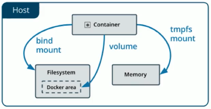

# Contenedor

* Es la piesa fundamental de docker.
* Es una agrupación de procesos de uno o mas procesos.
* Es una entidad lógica. No tiene ese límite extricto que es la emulación de un sistema operativo o hardware si hace falta asi como lo hace una máquina virtual.
* Ejecuta sus procesos de forma nativa como si fuera cualquier otro proceso del sistema operativo de la máquina host (anfitrión).
* Los procesos que se ejecutan dentro de los contenedores ven su universo como el contenedor define.
* No tienen forma de consumir mas recursos de lo que el contenedor lo permite.
* El unico software que se comparte entre un conenedor y el host, es el kernel del sistema operativo. Por eso docker corre de forma nativa en linux, porque utiliza el kernel de linux. Las versiones de Mac y Linux son un tipo de virtualización.
* Cuando el contenedor corre tiene acceso al directorio que le indicamos, pero no va poder tocar lo que esta hacia fuera, ya que desde ahi empieza su root.
* Docker hace que los procesos dentro del contenedor esten completamente aistados del todo el sistema, no le permite ver más alla de lo que el demonio lo define.
* Tiene su propio stack de networking, sus propios puertos no son los mismos que la máquina host. Si un puerto en el contenedor esta abierto eso no implica que ese puerto este abierto en la máquina, esperando conexiones a ese contenedor. Por lo tanto debemos explicitamente que un puerto de  la máquina host vaya a un puerto del contenedor.
* Los contenedores que tienen como tag <none> son versiones anteriores de un contenedor que se ha ido reconstruindo.
* https://itnext.io/chroot-cgroups-and-namespaces-an-overview-37124d995e3d

## Correr un contenedor

Cada docker run genera un contenedor nuevo, lo que si pueden compartir es la descripción o imagen.

```shell
docker run hello-world

# Pra que me me desatache la terminal de lo que sea del proceso que esta corriendo dentro
docker run --detach --name server nginx

# Correr un contenedor y cuando termine que lo elimine con --rm 
docker run --rm -p 3000:3000 platziapp
```

Cuando no encuentra la definición del contenedor, lo busca y lo descarga; y si tiene solo la corre.

## Estado de docker

* Todos los contenedores tienen un Id único.
* Tienen nombres generados automáticamente.

Ver el estado de los contenedores

```shell
docker ps

docker ps -a
```

Inspeccionar que es lo que tiene un contenedor. El cual nos devuelve una metadata del estado del contenedor.

Si queremos saber algo del contenedor de forma programática desde algun script del sisguiente comando podemos sacar la data.

```shell
docker inspect id_del_contenedor
# O
docker inspect nombre_container
# Filtrando la información a traves un template de filtros.
# En este caso le filtramos que nos devuelva las variables de entorno
docker inspect -f '{{ json .Config.Env }}' nombre_contenedor
```

Renombrar a un contenedor.

```shell
docker rename nombre_actual nuevo_nombre

docker run --name hola-mundo hello-world
```

Ver el output que genero el contenedor:

```shell
docker logs nombre_contenedor
```

Borrar un contenedor

```shell
docker rm nombre_contenedor
```

Imprimir solamente los Ids de los contenedores

```shell
docker ps -aq
```

Eliminar todos los contenedores utiliando shell Foo

``` shell
docker rm -f $(docker ps -aq)
```

## Modo interactivo

Correr el contenedor el comando que se vaya a correr pero de forma iteractiva con mi terminal.

Como hostname de la máquina, docker asigna el id del contenedor.

El significado de las flags `-it`:

- -t: Asignar un pseudo-tty (Terminal).
- -i: mantén STDIN abierto incluso si no está conectado.

```shell
docker run -it ubuntu
```

Ver que linux estamos corriendo.

```shell
uname -a

# Ver la data de que linux esta corriendo
cat /etc/lsb-release
```

## Ciclo de vida de un contenedor

* Si se apaga el proceso (comando) que esta corriendo, el contenedor se apaga.
* La solución es darle al contenedor que no ejecute ese comando, si no mas bien ejecute otra cosa que no se apage.

Indicandole que corra otro comando

```shell
# imprimir el standar output de un archivo
# -f quedarse esperando a cosas nuevas
# /dev/null es el barril sin fondo
# docker definicion comando
docker ubuntu tail -f /dev/null
```

Ejecutar un comando en un docker existente

```shell
# Entrar al contenedor de forma iteractiva
docker exec -it nombre_contenedor bash
docker exec -it db bash

# Ver todos los procesos de toda las sesiones que se estan ejecutando en un sistema operativo
ps -fea
```

Docker siempre por defecto le asigna el PID 1  al comando que corre con el contenedor. Este el root proces (root comand) que tiene un contenedor, cuando termine este comando se apagara el contenedor.

Terminar el contenedor 

```shell
# Enviar una señal de kill al contenedor
docker kill nombre_contenedor

# Eliminar forzosamente un contenedor
docker rm -f nombre_contenedor
```

## Publicar un puerto

* localhost cuando esta dentro de un contenedor hace referencia al mismo contenedor y no a la máquina host.
* Docker nos permite utilizar redes virtuales para conectar contenedores.

```shell
# docker run --detach --name server -p (publicar) puerto_host:puerto_contenedor nginx
docker run --detach --name server -p 8080:80 nginx
```

## Datos

Crear un lugar donde el contenedor pueda almacenar sus datos.

Hacer persistencia de los datos por fuera de los contenedores.

Docker nos ofrece tres formas de hacerlo

https://docs.docker.com/storage/



```shell
# Ver si un directorio si hay datos
ll directorio
ls -lac directorio
```

### Bind Mounts

* Persistencia de datos por fuera de los contenedores. Montando un parte del sistema de archivos de la máquina host en el contenedor.
* Hay una parte del sistema que esta expuesta a lo que puede hacer el contenedor. Estos directorios estan despejados lo que se cambie en uno va verse reflejado en el otro.
* El riesgo es que otros procesos de la maquina que toquen esos datos por algun motivo pueden llegar a modificar el funcionamiento del contenedor y eso es muy util pero peligroso.

```shell
# montar un directorio a un contenedor nuevo, como parte de su sistema de archivos.
# crear un volumen como Bind Mount es el primer formato que trajo docker es el mas historico y esta desde siempre, no es el mas perfecto pero el mas se usa.
# docker run -d --name db -v path_host:path_contenedor mongo
docker run -d --name db -v /run/media/byron/Data/containers/mongodata:/data/db mongo

# Correr una aplicacion y que esta se borre cuando termine
docker run --rm -p 3000:3000 --name webapp -v ${PWD}:/usr/src platziapp
```


### Docker Volums

* Es la evolución del Bind Mount.
* Funcionan de la misma manera con la excepcion de que el lugar donde escriben y donde esos archivos van ha esta es una área manejada por docker, donde el resto de procesos no deberian tocar.
* Todos estos se almacenan en un mismo lugar que es en /var/lib/docker/volumes.
* Los contenedores que vamos creando pueden crear este tipo de volumenes. Es decir un contenedor en su descripción o definición puede declarar que va usar volumenes.
* Permite persistir datos entre contenedores sin necesidad de montar directamente del file system, que la podemos perder o ensuciar con cosas que no son del contenedor.
* Nos herramientas para migrar volumenes de una computadora a otra.
* Y además nos permite especificar un driver no necesariamente de escritura en disco, sino también se puede conectar con un almacenamiento remoto como: S3 de Amazo, Storage Acount de Azure, podemos usar almacenamiento en la nube y que los container utilicen eso.

```shell
# Ver los volumenes que tenemos
docker volume ls

# Borrar todos los volumenes que no esten en uso por algun contenedor
docker volume prune

# Crear un volumen nuevo para los datos
# docker volume create nombre_volumen
docker volume create dbdata

# Correr un contenedor con un docker volumen
# docker run -d --name db --mount src=nombre_volumen,dst=path_contenedor mongo
docker run -d --name db --mount src=dbdata,dst=/data/db mongo
```


### Temporal File Ssystem (tmpfs) munt

* Consiste en que esa parte del contenedor este solamente en memoria y cuando se apaga el contenedor desaparece o pierde.
* Se utiliza por motivos de seguridad.

