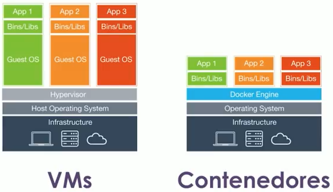

# Docker

* Resuelve problemáticas en el desarrollos como:
  * Construir.
    * Dependencias de desarrollo.
    * Versiones de entornos de ejecución.
    * Equivalencia de entornos de desarrollo.
    * Equivalencia con entornos productivos.
    * Versiones/compatibilidad con 3ras partes.
  * Distribuir.
    * Output de build heterogéneo.
    * Acceso a servidores productivos.
    * Ejecución nativa vs. virtualizada.
    * Serverless.
  * Ejecutar.
    * Dependencias de aplicación.
    * Compatibilidad de sistemas operativos.
    * Disponibilidad de servicios externos.
    * Recursoso de hardware.
* Permite construir, distribuir y ejecutar el código en cualquier lado.
* Esta escrito en Go.

## Contenedores

* Son agrupaciones de procesos que estan aislados del resto del mundo.
* Corre directamente sobre el sistema operativo base de la maquina física y lo hace solo utilizando en engine de Docker.
* Si las aplicaciones tienen las misma dependencias y bibliotecas eso en disco existe una sola vez porque son inmutables no se tocan y lo unico que cambia es la ultima parte del contenedor donde esta la aplicación.
* Son versátiles
  * Van en el ordern de los MB.
  * Tienen todas las dependencias que necesitan para funcionar correctamente.
  * Funcionan igual en cualquier lado.
* Eficientes.
  * Comparten archivos inmutables con otros contenedores.
  * Sólo se ejecutan procesos, no un SS.OO. completo.
* Aislados.
  * Lo que pasa en el container queda en el container.
  * No pueden alterar su entorno de ejecución (a menos que explícitamente se indique lo contrario).



## Instalación.

Hacer que un usuario pueda utilizar docker.

```shell
sudo usermod -aG docker nombre_usuario
```

## Arquitectura de Docker


* Tiene una arquitectura típica cliente - servidor, donde el servidor es un demonio del sistema operativo y el cliente es otro programa que esta corriendo.
* El servidor es el que crea los contenedores y los administra.


