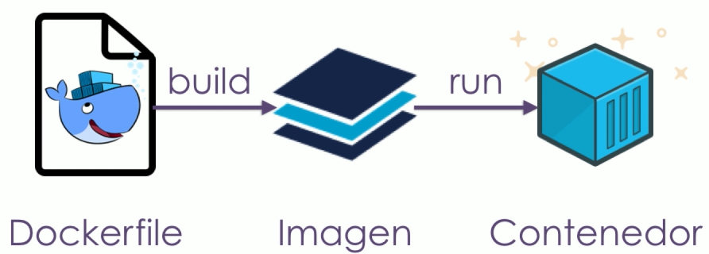

# Imagenes

* Son plantillas de contenedores.
* A partir de imagenes generamos contenedores que vamos utilizar.
* Pueden distribuirse de manera muy simple.
* Y es la forma en como distribuimos las aplicaciones.
* Es un conjunto de capas y esta construida siempre con una capa base y capas que se van montando sobre esa.
* Cada capa es inmutable.
* Cada capa marca una diferencia con respecto a la anterior a nivel de file system. Cada capa es una pequeña diferencia con la anterior por eso son muy livianas.
* El nombre de la imagen en realidad se llama repositorio.
* Las imagenes vienen de docker hub.
* hub.docker.com
* Library: docker.io/library. Contiene imagenes publicas oficiales y estan en un repositorio especial llamado library

## Obtener la imagen de un contenedor

Traer una imagen que no tenemos

Cuando se trae una imagen se puede bajar todas en paralelo.

```shell
# docker pull nombre_imagen
docker pull redis

# Indicando una version (tag) especifica de la imagen
docker pull ubuntu:18.04
```

Ver  que imagenes tengo disponibles

```shell
docker image ls
```

## Crear imagenes

* Para hacerlo se necesita de un archivo llamado Dockerfile.
* Dockerfile
  * Es la receta que utiliza docker para crear imagenes.
* Contexto de build, toma un sector en el disco y todo eso se lo da al demon de docker y este puede usar todo lo que esta ahi en tiempo de build, no puede usar nada que este afuera.

```shell
# docker buuild -t nombre_de_la_imagen:tag path_contexto_build
docker build -t ubuntu:platzi .

# docker buuild -t nombre_de_la_imagen path_contexto_build
docker build -t platziapp .
```

### Flujo del build de una imagen




### Publicar una imagen

```shell
# Login
docker login

#docker push nombre
# Lo siguiente no funciona ya que se esta intentando subir a un repositorio library y no de mi cuenta
# Docker utiliza el conceprto de los tags para saber a que repositorio se refiere cada imagen
docker push ubuntu:platzi

# Agregar un tag a una imagen
# docker tag ubuntu:platzi usuario/repositorio:version
docker tag ubuntu:platzi usuario/ubuntu:platzi

# Aqui ya se sube al repositorio del usuario
docker push uausrio/ubuntu:platzi
```

### Sistema de capas

* No importa tanto el resultado final sino importa lo que cada layer hace, por cada cambio se crea un nuevo layer.
* Partir de una capa que no tiene nada, solo parte del kernel de linux no hay ningun otro binario. A traves de scratch.

```dockerfile
FROM scratch
```

History

Nos lista todas las capas que contiene la imagen y cuanto ocupan.

```shell
# docker history nombre_imagen
docker history ubuntu:platzi

docker history --no-trunc ubuntu:platzi

# dive nombre_imagen
dive ubuntu:platzi
```

## COPY

* Partiendo del contexto de build de docker va copiar lo que yo le diga del contexto de build a un destino a la imagen que estoy creando.
* Con punto (.), se indica que copie todo.
* Usualmente se utiliza el path /usr/src, para poner datos de la aplicación.

```dockerfile
COPY [".", "/usr/src/"]
```


### WORKDIR

* Es como un cd de la linea de comandos

```dockerfile
WORKDIR /usr/src
```

### EXPOSE

* Exponiendo el contenedor a traves de un puerto.

```dockerfile
EXPOSE 3000	
```

### CMD

* Para definir cual es el comando por defecto que va correr el contenedor, que se crea a partir de esta imagen.

```dockerfile
CMD ["node", "index.js"]
```


 

