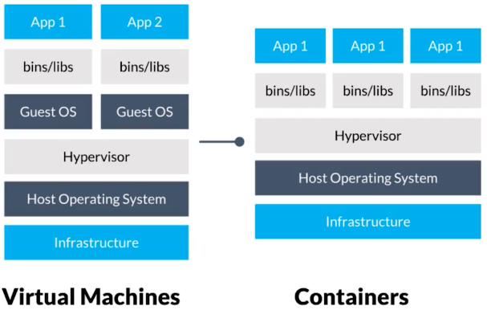

# Contenedores

* Es un concepto abstracto que se conforman de diferentes tecnologías que potencian las unas a las otras y que trabajando en conjunto permiten que esta tecnología sea posible.
* Comparten un mismo sistema operativo, los contenedores hablan directamente sobre el sistema operativo de la computadora y las aplicaciones comparten el mismo kernel.
* Esta compuesto de tres tecnologías:
  * Cgroups (Control groups): Limitan y miden los recursos del SO. Son los que permiten que un contenedor o un proceso tenga aisladas tanto sus recursos de momoria, de IO (disco o red) y CPU.
  * Namespaces: Vistas de los recursos del SO. Permiten aislar que ese proceso viva en un sanbox y no pueda ver otros recursos, como el sistema operativo que esta debajo o otros contenedores. Hay algunos tipos de namespaces (7), entre estos los más importantes son:
    * Mount namespace: Lo que nos va permitir es que el proceso tenga una visibilidad reducida de los directorios donde trabaja, asi como también las carpetas que monta y sobre las cuales puede trabajar. Esto permite que dos contenedores no puedan interferir entre si y no puedan modificar un archivo de otro.
    * Network namespace: Es importante porque permite que cada contenedor tenga su stack de red, su interface de red, dirección IP, su tabla de rutas y que no interfiera con otros contenedores.
    * PID (Procesos) namespace: Cada contenedor su porceso principal tiene como id 1.
  * Chroot: Cambia el root directory de un proceso. Nos permite que nuestro proceso tenga visibilidad de los archivos que estamos trabajando y no pueda acceder a otros recursos del sistema.

## Docker

* Se encarga principalmente de gestionar los contenedores. Se encarga del ciclo de vida de los contenedores.