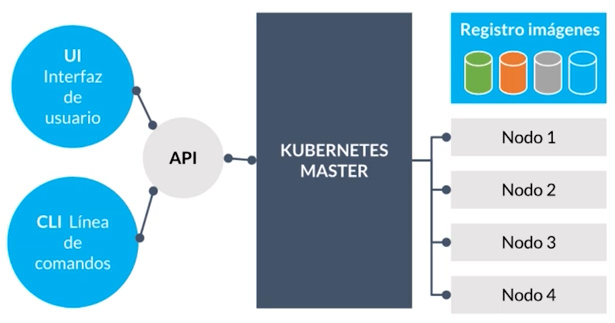
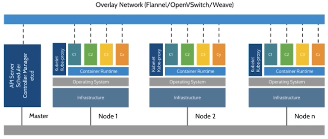

# Kubernetes

* Es un sistema de orquestación de contenedores que administra contenedores a escala.
* Empezo en el 2016. Surgio de de un pryecto interno de Google llamado borg -> 7v9.
* Utiliza container runtime por debajo para poder orquestar todos sus servicios.
* Trabaja con una indentidad de orquestación que se llama POD.
* POD es la unidad de orquestación, este es un grupo de contenedores que pueden estar corriendo uno a lado del otro en el mismo host. Un POD vive en un nodo. Puede haber un Pod de un único contenedor o de múltiples contenedores.
*  Todos los contenedores que viven dentro de un Pod, comparten el mismo segmento de red (namespace de red). Es decir tienen la misma drección Ip y se ven unos a otros como un proceso que estan corriendo en el mismo sanbox.
* En kubernetes cuando se escala algo se escala el Pod, se crean copias de ese Pod para escalarlo. Son unidades que se reciclan.
* Es una herramienta que hace work look placement. Permite relacionar contenedores, hacer crecer nodos bajo demanda y correr contenedores o pod en nodos especificos y hacer que las aplicaciones se comuniquen entre si.
* Es una evolución de los proyectos de Google Borg & Omega.
* Kubernetes pertenece a la CNCF (Cloud Native Computing Foundation). CNCF Esta fundacion agrupa a algunos proyectos y tiene promotores de equipos y companias que apoyan el Open Source.
* Todos los cloud providers (GCP / AWS / Azure / DO) ofrecen servicios de managed k8s utilizando Docker como su container runtime.
* Es la plataforma más extensiva para orquestación de servicios e infraestructura.
* Corre varias réplicas y asegura que todas se encuentren funcionando.
* Provee un balanceador de carga (interno o externo) automáticamente para nuestros servicios.
* Definir diferentes mecanismos para hacer roll-outs de código. Permite definir estratégias de deployment.
* Políticas de scaling automáticas.
* Jobs batch
* Correr servicio con datos stateful
* Y muchas otras cosas (CRDs Custom resources definitions definir mis propios recursos, Service catalog saber que esta desplegado, RBAC Rol Base Access Control permite al orquestador dar políticas de roles)
* Se basa en el algoritmo de conseso de albitraje, esto permite tener varios master en el cluster y cuando uno de estos no responde, que otro tome el control.

## Arquitectura



* Esta conformado por dos grandes partes:
  * Nodos master: Los que controlan el estado o cerebro de kubernetes.
  * Minions: Los nodes de trabajo.
* Se puede trabajar con kubernetes de dos manera:
  * API: Que expone la plataforma. Se lo puede hablar de una forma iperativo o modelo declarativo.
  * UI: Interfaz de usuario. Kubernetes Dashboard.
  * CLI: Línea de comandos. K CTL.

* Registro de imagenes: Los nodos se conectan al registro de la imagen.



Nodo Master

Control Plain o cerebro de kubernetes. Esta compuesto de:

* API Server: Es a lo que todo se conecta, como los agentes que viven en los nodos, cuando se ejecuta comandos en el K CTL o Kubernetes Dashboard. Al ser el cerebro del cluster es el que entiende que esta sucediendo, esto se pierde cuando un nodo cluster se cae. Es el unico que se conecta a etcd.
* Scheduler: Se encarga de cuando quiero crear algun tipo de trabajo ya sea un Pod o proceso. Este se encarga de decir tal Pod va a un nodo y este entiende cuanto recursos disponible tiene nuestro cluster. Asigna los contenedores y Pods a los nodos.
* Controler Manager: Es un proceso que esta en un ciclo de reconcilación constante. Lo que permite estar mirando constante mente al cluster e intentar que los servicios lleguen a ese estado deseado.
* etcd (key value store): Es una base de datos de alta disponibilidad, para lider election y cuando el nodo master se cae evitar que el cluster quede sin servicio.

Container Runtime

* Suele ser docker en la mayoria de los casos.
* Las ultimas versiones de kubernetes 1.14, ya vienen con Container De por default que es un subtrip down de lo que es el core de docker.

Kiubelet

* Es el agente de kubernetes, el que se conecta con el Control Plain y le pregunta que recursos debe correr. Es un proceso que esta corriendo constantemente y que se comunica con el API Server. Obtiene la información y se encarga de correr los contenedores o pods en el nodo. Actualiza el control plain con el estado de los contenedores.
* Corre los lines props, es la manera de decir si un Pod o contenedor funciona de la manera correcta.

Kiube-proxy

* Valancea el trafico que corre en el contenedor o servicios.
* Es el componente del cluster que se encarga cuando llega un paquete TCP/IP decide a donde tiene que ir, a que Pod y contenedor. 

## Modelo Declarativo e Imperativo

* Kubernetes hace énfasis en ser un sistema declarativo
* Declarativo: "Quiero una taza de té". A la hora de definir una tarea esta se define de manera que se le da un contexto y se le agrega una especificación le estoy diciendo como. Si por alguna razon se cae un nodo, entendiendo el contexto se puede observar y entender en donde se quedo o cuál fue ese error y volver y ver la diferencia entre el estado deseado y en donde me quede e intentar que se converga ha ese estado deseado. A traves de manifest file yaml declaro que quiero que suceda y a donde quiero que llegue el cluster.
* Imperativo: "Hervir agua, agregar hojas de té y servir en una taza". Esta compuesto sobre una serie de pasos que se los debe serguir a raja tabla de manera ciega sobre cual no se tiene un contexto. Si algún momento de todo ese proceso se interrumpe por algún motivo, tengo que comenzar desde principio para poderlo ejecutarlo. Es cuando utilizo el K CTRL o el dashboard y le digo que es lo que quiero que suceda, y si algo pasa pierdo el contexto de lo que estoy haciendo.
* Declarativo parece sencillo (siempre y cuando uno sepa cómo hacerlo).
* Todo en K8s se crea desde un spec que describe cuál es el estado deseado del sistema.
* Kubernetes constantemente converge con esa especificación.
* Hay una metodología llamada Git tops, lo que intenta es hacer que todas estas especificaciones las versione en un repositorio y luego el cluster tome estas de manera automática y empiece a converger.

## Modelo de Red

* Todo el cluster es una gran red del mismo segmento.
* Todos los nodos deben conectarse entre sí, sin NAT.
* Todos los pods deben conectarse entre sí, sin NAT.
* kube-proxy es el compenete para conectarnos a pods y contenedores (userland proxy / iptables)
* Los pods trabajan a capa 3 y los servicios a capa 4.
* Concepto de CNI (container networking interface). Arreglan reglas de Ip tables, las cuales permiten cambiar las reglas de enrutamiento.

## Cluster

* Es una agrupación de máquinas que corren una cierta cantidad de servicios para que pueda funcionar una aplicación sobre kubernetes.
* Sobre estas maquinas va correr:
  * Docker runtine
  * Kubelet agent
  * Network proxy

### Nodo Maestro

* Un nodo de kubernetes hace referencia a un servidor, se encarga de administrar el estado del cluster.
* Ejecuta Etcd, que almacena datos de clústeres entre componentes que organizan cargas de trabajo en nodos de trabajo.
* Es la puerta de entrada a todo el cluster. Endpoint
* Kubernetes API server
  * Agendamiento de pods
  * Sincronización de servicios.

### Nodo de Trabajo

* Son los servidores en los que se ejecutarán las cargas de trabajo, es decir las aplicaciones y servicios de contenedores.
* Un trabajador seguirá ejecutando su volumen de trabajo una vez que se le asigne, incluso si el maestro se desactiva cuando la programación se complete. La capacidad de un cluster puede aumentarse añadiendo trabajadores.
* Es un worker machine en kubernetes.
* Son conocidas como nodo minions, se utilizan y se desechan y ahi corren las aplicaciones.
* Tiene todas las herramientas para desplegar las aplicaciones.
* Puede ser una VM o una máquina física.
* Tiene los servicios necesarios para correr pods.

#### Estado de un Nodo

* Addresses
* Condition
* Capacity
* Info

## Pod

* Es un conjunto de contenedores que se despliegan en los nodos y que van a contener la aplicación.
* Es la unidad minima con la que vamos a poder gestionar los workflow o las cargas de trabajo.
* Un pod envuelve el contenedor o varios.
* Cuando se crea varios contenedores dentro de un Pod debe ser cuando queremos que se comuniquen entre ellos.
* Dentro del cluster se asigna una ip interna al Pod.
* Toda la arquitectura de kubernetes se crea a traves de un Pod, eso es el scheluder, Server API, toda la parte networking.

```shell
# Ver los Pods de todos los namespaces
kubectl get pods --all-namespaces

# Traer los Pods de un namespace especifico
kubectl get pods -n kube-system

# Cuando se instala un cluster con kubeadm este guarda los certificados y los secretos del cluster en un namespace kube-public
kubectl get secrects -n kube-public

# Correr un Pod DEPRECADO
# kubectl run nombre_pod --image nombre_imagen comando
kubectl run pingpong --image alpine ping 1.1.1.1

# Ver logs
# Podemos especificar el nombre del Pod o el nombre del deployment
# kuberctl logs deploy/nombre
kuberctl logs deploy/pingpong
# Ver las ultimas 20 lineas
kuberctl logs deploy/pingpong --tail 20
# Hacer un follow
# -f Sigue los logs de ese Pod
kuberctl logs deploy/pingpong --tail 20 -f

# Ver los logs de todos los pods que esten corriendo a traves de un selector
kubectl logs -l run=pongpong

# Describe del Pod
# kubectl describe pod nombre_pod
kubectl describe pod pingpong

# watch
kubectl get pods -w

# Eliminar un pod
kubectl delete pod nombre_pod

# Ver la especificacion
# kubectl run --dry-run -o yaml nombre_pod --image imagen comando
kubectl run --dry-run -o yaml pingpong --image alpine ping 1.1.1.1

# Ingresar a dentro de un Pod
kubectl exec nombre_pod -ti bash
```


## Desplegar cluster de Kubernetes

### Minikube

* Es un projecto open sourse.
* Permite desplegar un cluster de kubernetes en la máquina local.
* Es un utilitario que por debajo utiliza opciones de Hypervisores, como pueder ser virtual box o KVM o QMu
* Desplega un cluster minimo de kubernets en unico node master, para desplegar las tools y correr los Pods

### Kubeadm

* Automatiza la instalación y la configuración de componentes de kubernets como el servidor de API, Controller Manager y Kube DNS.
* No crea usuarios ni maneja la instalación de dependencias al nivel del sistema operativo ni su configuración. Para ello se puede utilizar Ansible o SaltStack.

### Amazon EKS

* Crear la estructura de cluster que queremos y despues se configura al utilitario que se conecte al cluster.


## Minikube

* Trabaja con un unico nodo.
* Se puede agregar addons

Iniciar un cluster

```shell
# Crear una maquina virtual nueva
minikube start
# Cambiar las caracteristicas
minikube start --cpus=3 --memory=3000mb

minikube start -p nombre

# Pararlo
minikube stop

# Permite hacer un set al cluster que queremos configurar
minikube config

# Ver el estado del cluster
minikube status

# Ver la ip
minikube ip

# Desplegar el dashboard
minikube dashboard

# Ver la lista de addons
minikube addons list

# Ver los logs
minikube logs

# Conectarce por ssh
minikube ssh
```

## kubectl

* Es el CLI tool que se utiliza para iteractuar con el cluster de kubernetes
* La herramienta para gestionar el cluster de kubernetes es kubectl.
* Da igual donde este el cluster podemos utilizar kubectl
* Archivo de configuración de como kubectl se va a conectar a kubernetes se encuentra en: /home/byron/.kube/config. Este archivo config tiene la difinición que utiliza kubectl para conectarce a un cluster.
* Nos ofrece una API, la cual podemos atacarlo directamente o con una herramienta tipo Terraform de infraestructura scope.

```shell
# kubectl operacion recurso
# Para conectarse a otros cluster de un archivo distinto
kubectl --config
# Tambien se puede indicar el servidor y el usuario
kubectl --server    --user

# Lista todos los nodos que tiene el cluster
kubectl get nodes
# Muestra mas datos
kubectl get nodes -o wide
# Obtener informacion de los nodos en yaml
kubectl get nodes -o yaml
# Obtener una descripcion de un nodo
kubectl describe nodes node1
# Ver la definicion del nodo para poderlo construir
# kubectl explain recurso.atributo
kubectl explain node
kubectl explain node.spec
# Es verbose que nos indica como debemos contruir un node
kubectl explain node --recursive

# Ver los servicios donde corre el minikube
kubectl get service

# Ver todos los recursos del cluster
kubectl get all

# Crear un Pod a traves de un manifest
kubectl apply -f pod.yaml
# Ver si la sintxis esta correcta del archivo si aplicarlo
kubectl apply -f replicaset.yml --dry-run

# Obtener la informacion de un Pod
kubectl get pod nombre_pod

# Obtener una descripción de un Pod
kubectl describe pod nombre_pod

# Conectarce a un Pod
kubectl exec -it nombre_pod bash

# Eliminar un Pod
kubectl delete pod nombre_pod

#Eliminando todo lo que se ha definido en el manifest
kubectl delete -f pod.yml

# Borrar todo lo que tenemos definido en el directorio
kubctl delete -f .

#Mapear un puerto
#kubectl port-forward nombre_pod puerto_maquina:puerto_container
kubectl port-forward webserver 8080:80

# Obtener los replication controller
kubectl get rc

# Abrir una ventana donde cada segundo se pida los datos a kubernetes
 watch -n1 kubectl get rc,pod
 
 # Lista de todos los recursos que podemos crear en kubernetes
 kubectl api-resources
```


## Replication Controller

* Nos va permitir que podamos controlar el número de copias de un Pod que vamos a tener en ejecución.
* Nos sirve para escalar un Pod.
* Cuando se crea un Pod a través de un RC, se le agrega al nombre un sufijo.
* Se encarga que almenos siempre exista una copia corriendo del Pod.
* Si se elimina un Pod, el replication controles lanza otro para siempre asegurarse de que siempre hay una copia.
* Es un objeto que se tiende a no utilizarlo solo.
* El RC no se tiende a utilizar por si solo sino a traves de un objeto llamado deplyment a traves de ReplicaSet, que es la forma mas actual.

```shell
# Obtener información del repliation controller
kubectl describe rc nombre

# Scalar
kubectl scale rc nombre --replicas 0
```

## Namespaces

* Separan el cluster en diferentes clusters virtuales de forma que tengamos diferentes recursos desplegados en el cluster aislados entre ellos, incluso aislar el acceso a los usuarios.
* Todos los recursos que vayamos creando se van a poner en el namespace default.
* kube-systme: Aqui se desplieaga algunos componentes importantes del cluster.
* Podemos tener diferntes recursos con el mismo nombre siempre y cuando se encuentren en diferentes namespaces.
* No se puede ligar un nodo a un namespace.
* Se utiliza para poder aislar lo que podemos ver en un contexto en sanbox determinado.

```shell
# Obtener los namespaces
kubectl get namespaces

# Creando un namespace
kubectl create namespace nombre

# Ver todos los recursos que estan en un namespace
kubectl get all -n nombre_namespace
kubectl get all --namespace nombre_namespace

# Ver que objetos o recursos pueden esstar dentro de un namespace
kubectl api-resources --namespaced=true

# kubectl -n nombre_namespace port-forward nombre_pod puerto_maquina:puerto_contenedor
kubectl -n webserver port-forward webserver 8080:80

# Ver los pods con sus etiquetas
kubectl get pods -n webserver --show-labels

# Scalar un rc dentro de un namespace
kubectl -n webserver scale rc webserver --replicas 0
```

## Servicios

* Permite darnos acceso externo a nuestro cluster en cuanto a una aplicación concreta, esto suele ser un Pod o un conjunto de Pods que se iran lanzando a traves de un objeto que gestione Pods, como los deplyments o los ReplicaSet.
* Es un recurso que esta a lado de un Pod el cual nos permite conectarnos a travez de el a traves de las IPs y los puertos.
* Los servicios pueden ser de 4 formas diferentes:
  * ClusterIP: Reserva una Ip virtual dentro del cluster y todo el trafico que llege a esa Ip se van a reenviar a los Pod que esten asociados a ese servicio. Es una especie de valanciador de carga con una Ip unica pero internamente en el cluster.
  * NodePort: Nos permite decir al cluster que en cada uno de los nodos se va exponer un puerto y ese puerto va enviar el trafico al contenedor. Crea un cluster-ip y un puerto. Todos los nodos del cluster utilizan el mismo puerto y el puerto va entre los  30000 - 32000, eso esta especificado en el API Server.
  * LoadBalancer: Sirve para los proveedores de Cloud. Se crea una balaceador de carga y ese balanceador externo va enviar el trafico a los Pods.
  * ExternalName: Asocia un nombre. Una entrada de DNS manejado por CoreDNS.
* Enrutamiento del trafico de los servicios a nivel low level utilizando kube-proxy que es este componente que se encarga de establecer las reglas en los nodos para enrutado de trafico. Enruta en cantidad de paquetes salientes.
* Kubernetes de EndPoints: Es un recurso que son las direcciones Ip de un servicio a las cuales necesitariamos acceder en el caso si queremos llegar a ese servicio.

```shell
# Crear un servicio
# kubectl expose deployment nombre_deploy --port=8888
# Por defecto se crea un servicio ClusterIP, a menos que se indique lo contrario
# Esto reserva una Ip interna del cluster
# Se reserva un puerto interno de tipo ClusterIP para la red interna. Para una red externa se debe hacer del tipo NodePort que reserva un puerto en el nodo
# Se asigna una unica IP para los Pods
kubectl expose deployment httpenv --port=8888

# Ver los servicios
kubectl get svc
kubectl get service

#Bash hacer 10 solicitudes
for i in $(seq 10); do curl -s http://ip:puerto | jq .HOSTNAME; done

# Ver reglas iptables del computador, de la tabla de nat, listar reglas de chain output
sudo iptables -t nat -L OUTPUT
sudo iptables -t nat -nL KUBE-SERVICES
sudo iptables -t nat -nL target

# Describir el servicio
kubectl describe service httpenv
# Ver los endpoints
kubectl describe endpoints httpenv
kubectl get endpoints httpenv -o yaml

# Eliminar un servicio
kubectl delete service httpenv
```


## ReplicaSet

* Los selectores son más flexibles a diferencia del RC.

* Funciona de forma similar a un RC.

* Es el controller o el recurso que va controlar la cantidad de replicas e instancias que tiene el Pod.

* Es una estructura, un constract de más log level.

* Se asegura que aya una cantidad de pods definida corriendo en un determinado momento. Permite hacer el scaling.

* Es raro que se utilice directamente, se hace a traves del deployment

  

```shell
# Scalar
kubectl scale rs webserver --replicas=1

# Obtener información
kubectl get rs

# Descripcion
kubectl describe rs

#Escalar el deployment
# Redistribuye a los nodos, y lo que trata de hacer es que la carga este distribuida en la mayor cantidad de nodos disponibles
kubectl scale deploy/pingpong --replicas=8
```

## Deployments

* Es un objeto especial de kubernetes que nos va permitir crear una serie de Pods a traves de ReplicaSets, es decir el deployment va crear los ReplicaSet.
* Nos permite realizar despliegues.
* Nos permite hacer updates a un Pod. Si se quiere actualizar la version del Pod se realiza a traves de un deployment.
* Esta es la entidad de mayor gerarquia, de la cual depende del ReplicaSet.
* Es una estructura de mas alto nivel que nos va permitir rolling-operates (Actualizaciones de version) y tambien rollbacks a la ultima version estable.
* Multiples deplyments pueden entrarce en juego para generar un Canari Deployment. Es cuando tenemos una version de la aplicación A y tenermos una version de la aplicación B, y podemos ir moviendo Pod de la versión de A a B.
* Delega la creación y scaling de los Pods a los ReplicaSet

```shell
# kubectl create deployment nombre --image nombre_imagen
kubectl create deployment httpenv --image jpetazzo/httpenv

# Escalar
kubectl scale deployment nomde_deploy --replicas=2

# Cambiar la imgen
# kubectl set image deployment nombre_deployment nombre_contenedor=imagen:tag
# Se realiza un rolling-update
kubectl set image deployment frontend nginx=nginx:1.17.6
```


## Kubeadm

* Permite desplegar y configurar un cluster de cubernetes.

## Amazon EKS

* Elastic Kubernete Service
* Es el serivcio de Amazon para de desplegar un Automatic Manage Kubernate Master
* Es un cloud provider.
* Permite escalar el cluster de manera sencilla.


Run robin

* Debe ir a un Pod distinto.
* En cantidad de request o peticiones que se hagan.

## Desplegar una aplicación

* Primero se debe desplegar los servicios Core. Los que no tienen dependencias.

  ```shell
  # Creando un deployment que se llame redis
  kubectl create deployment redis --image redis
  kubectl create deployment hasher --image=dockercoins/hasher:v0.1
  kubectl create deployment rng --image=dockercoins/rng:v0.1
  kubectl create deployment webui --image=dockercoins/webui:v0.1
  kubectl create deployment worker --image=dockercoins/worker:v0.1
  
  # Ver los logs
  kubectl logs deply/worker
  
  # Para accesder a un servicio a traver del cluster se debe exponerlo
  kubectl expose deployment redis --port 6379
  kubectl expose deployment rng --port 80
  kubectl expose deployment hasher --port 80
  kubectl get svc
  
  # Puerto publico
  # Reserva un puerto en todos los nodos para el servicio
  kubectl expose deploy/webui --type=NodePort --port=80
  ```

  

* 