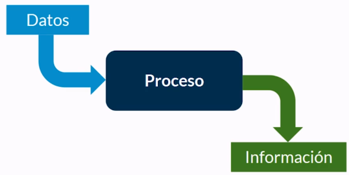

# Comunicación de procesos

## Procesamiento de datos



Datos que ingresan a un proceso y eso emite una información en la salida.

Los caneales por donde ingresan los datos a un proceso y salen la información se conocen como Flujos o frames.

Por defecto estos canales estan conectados a los perifericos comúnes.

Cuando se ejecuta un comando estamos lanzando un nuevo proceso.

### Flujos estándar

* La terminal conoce de tres flujos
  * Entrada estándar
  * Salida estándar
  * Error estándar

Redirección de la entrada estándar a un archivo

```bash
usuario@pc:~$ mysql -h 127.0.0.1 -u root -p1234 < archivo.sql
```

Redirección de la salida a un archivo

```bash
usuario@pc:~$ ls > nombre_archivo.txt
```

Agregar cosas a un archivo

Con >> agrega al final del archivo información

```bash
usuario@pc:~$ ls -l >> archivo_con_datos.txt
```

### Pipes o tuberias ( | )

* Tienen la idea de tomar la salida de un proceso y pasarlo directamente como entrada a otro proceso
* more: muestra un resultado largo en varias iteraciones. Permitiendos bajar con enter
* wc: Cuenta cuantos caracteres hay en un flujo

```bash
usuario@pc:~$ ls -l | more

usuario@pc:~$ cat archivo | wc -l
```


## Proceso en Backgound

* Cuando un proceso se tarda mucho y se quiere seguir trabajando en la terminal se le puede agregar al final &. Asi el proceso se envio en backgound en segundo plano.
* Se lo puede mandar con CTRL + Z
* Se lo puede traer a primer plano (Foreground) con el comando: fg

## Demonios

* Son procesos ejecutandoce en background de forma constante.

```bash
# Ver procesos que estan corriendo
usuario@pc:~$ ps

# Procesos del sistema
usuario@pc:~$ ps ax

# Ver los procesos que tienen la palabra init
usuario@pc:~$ ps ax | grep init

# top es una utilidad interactiva para ver los procesos que se estan ejecutando
usuario@pc:~$ top

# Detener un proceso
# Foreground
usuario@pc:~$ CTRL + C

# Background
# kill envia señales a un proceso para que se detengan, permitiendo terminar lo que estaban haciendo y finalizar. Se le pasa el numero del proceso
# kill -9 Para que termine inmediatamente
usuario@pc:~$ kill -9 13063
# killall Hace los mismo pero no recibe el numero sino el nombre del archivo ejecutable que disparo ese proceso
```

