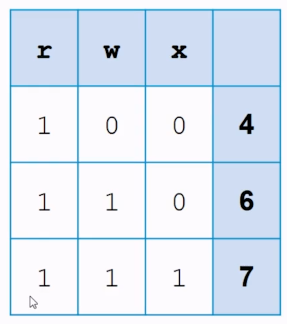
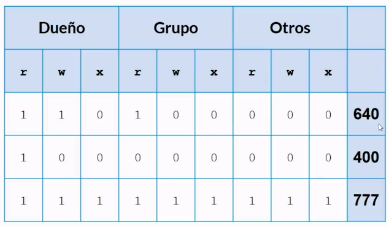

# Permisos

* Todos los archivos de unix tienen un dueño asociado que es la persona que creo el archivo, un grupo de usuarios que tienen acceso al archivo y que se le permite hacer a cualquier otro usuario que no sea el dueño o el grupo al cual esta asociado el archivo.
* Operaciones que se pueden hacer en un archivo son 3: Lectura, escritura y ejecución.
*  Esto configura una matriz

```bash
# Ver los permisos
usuario@pc:~$ ls -l

# - El guion indica que tiene negado
# El primer caracter indica el tipo de archivo d:directorio, l:link
# r lectura
# w escritura
# x ejecución, en directorios indican que puedo ingresar
-rw-rw-rw
rwxrwxrwx
#[dueño][grupo][otro]
```

## Cambiar permisos

```bash
# chmod cambia el modo del archivo es decir cambiar individualmente los permisos

# Cambiando con anotacion textual
# Quitar permisos
# o se refiere a otros usuarios
# - quitar
usuario@pc:~$ chmod o-w archivo.txt

# Agregar permisos a cualquiera
usuario@pc:~$ chmod +x archivo_ejecutable

# Cambiando permisos con anotacion binaria, los permisos son flags
usuario@pc:~$ chmod 760 archivo_ejecutable

# chown cambia quien es el propietario
usuario@pc:~$ sudo chown usuario archivo

# chgrp cambia quien es el grupo de usuario que puede acceder al archivo
usuario@pc:~$ sudo chgrp grupo archivo
```

Tabla de permisos de forma binaria






